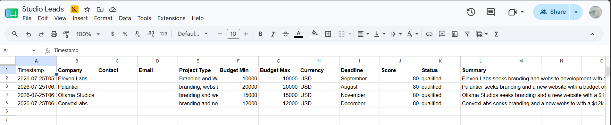
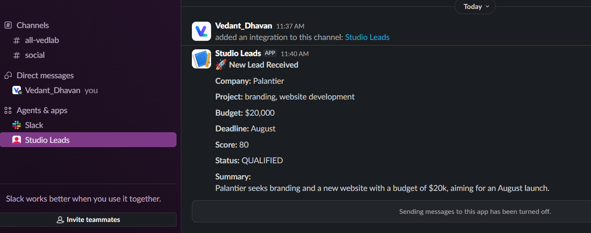
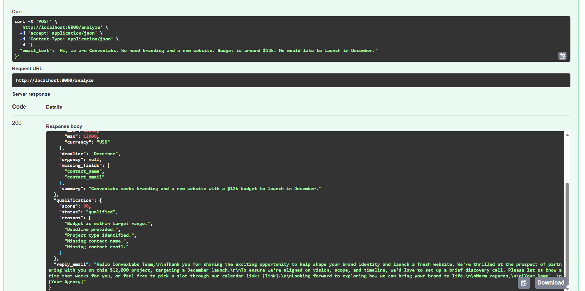
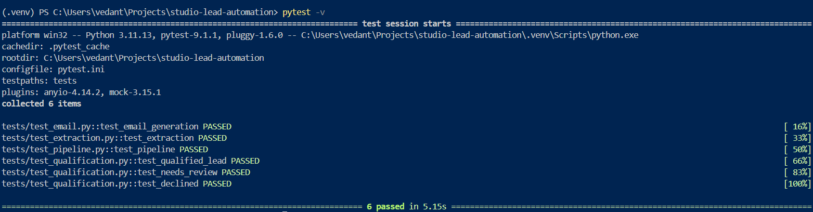

# Studio Lead Automation

An AI-powered lead intake automation system that transforms unstructured client inquiry emails into structured business data, qualifies leads using deterministic business rules, notifies the team, and generates professional follow-up emails.

Built with **FastAPI**, **Groq LLM**, **Pydantic**, **Google Sheets**, and **Slack**.

---

## Features

- AI-powered extraction of lead information from free-form emails
- Structured validation using Pydantic
- Deterministic lead qualification engine
- Google Sheets integration for CRM logging
- Slack notifications for new leads
- AI-generated personalized reply emails
- Modular workflow architecture
- Unit tested with pytest
- Docker support

---

## Architecture

```text
                    Incoming Email
                           │
                           ▼
                  FastAPI REST Endpoint
                           │
                           ▼
                    Lead Pipeline
                           │
        ┌──────────────────┼──────────────────┐
        ▼                  ▼                  ▼
  LLM Extraction     Qualification      Reply Generation
     (Groq)            (Python)            (Groq)
        │                  │
        └────────────┬─────┘
                     ▼
             Structured Lead
                     │
          ┌──────────┴──────────┐
          ▼                     ▼
   Google Sheets          Slack Notification
```

---

## Tech Stack

### Backend

- FastAPI
- Python 3.12
- Pydantic v2
- Uvicorn

### AI

- Groq API
- OpenAI Python SDK
- GPT OSS 20B

### Integrations

- Google Sheets API
- Slack Incoming Webhooks

### Testing

- pytest
- unittest.mock

### DevOps

- Docker
- Docker Compose

---

## Project Structure

```text
studio-lead-automation/
│
├── app/
│   ├── api/
│   ├── core/
│   ├── integrations/
│   │   ├── sheets.py
│   │   └── slack.py
│   │
│   ├── models/
│   ├── prompts/
│   ├── services/
│   │   ├── extraction_service.py
│   │   ├── qualification_service.py
│   │   ├── email_service.py
│   │   └── llm_service.py
│   │
│   ├── workflow/
│   │   └── lead_pipeline.py
│   │
│   └── main.py
│
├── tests/
├── Dockerfile
├── docker-compose.yml
├── requirements.txt
└── README.md
```

---

## Workflow

1. User submits an inquiry email.
2. Groq LLM extracts structured lead information.
3. Pydantic validates the extracted data.
4. Qualification engine scores the lead.
5. Lead is logged to Google Sheets.
6. Slack notification is sent.
7. AI generates a personalized follow-up email.
8. API returns the complete analysis.

---

## Lead Qualification Logic

| Criteria | Score |
|-----------|------:|
| Budget ≥ $10,000 | 40 |
| Budget ≥ $5,000 | 20 |
| Deadline Provided | 20 |
| Project Type Provided | 20 |
| Contact Name | 10 |
| Contact Email | 10 |

### Qualification Thresholds

| Score | Status |
|-------:|---------|
| 80+ | Qualified |
| 50–79 | Needs Review |
| Below 50 | Declined |

---

## API

### Analyze Lead

**POST**

```
/analyze
```

### Request

```json
{
  "email_text": "Hi, we're looking for branding and website development for our startup. Our budget is $15,000 and we'd like to launch in November."
}
```

---

### Response

```json
{
  "lead": {
    "company": "Ollama Studios",
    "project_type": "branding and website development",
    "budget": {
      "min": 15000,
      "max": 15000,
      "currency": "USD"
    },
    "deadline": "November",
    "summary": "Ollama Studios seeks branding and a new website with a $15k budget and a November launch."
  },
  "qualification": {
    "score": 80,
    "status": "qualified"
  },
  "reply_email": "Hi there,\n\nThank you for reaching out..."
}
```

---

## Installation

Clone the repository.

```bash
git clone <repository-url>

cd studio-lead-automation
```

Create a virtual environment.

```bash
python -m venv .venv
```

Activate it.

### Windows

```bash
.venv\Scripts\activate
```

### macOS / Linux

```bash
source .venv/bin/activate
```

Install dependencies.

```bash
pip install -r requirements.txt
```

---

## Environment Variables

Create a `.env` file.

```env
GROQ_API_KEY=your_api_key
GROQ_BASE_URL=https://api.groq.com/openai/v1
LLM_MODEL=openai/gpt-oss-20b

GOOGLE_SERVICE_ACCOUNT=service_account.json
GOOGLE_SHEET_NAME=Lead Automation

SLACK_WEBHOOK_URL=https://hooks.slack.com/services/...
```

---

## Running the Application

```bash
uvicorn app.main:app --reload
```

Open Swagger UI.

```
http://localhost:8000/docs
```

---

## Running with Docker

Build the container.

```bash
docker compose up --build
```

The API will be available at:

```
http://localhost:8000
```

---

## Running Tests

Run all tests.

```bash
pytest
```

Run with coverage.

```bash
pytest --cov=app --cov-report=term-missing
```

---

## Design Decisions

### LLM for Extraction

The language model is responsible only for converting unstructured text into structured JSON.

### Deterministic Qualification

Business decisions are implemented in Python rather than delegated to the LLM. This ensures predictable, explainable, and testable behavior.

### Modular Workflow

Each component has a single responsibility:

- Extraction
- Qualification
- Google Sheets
- Slack
- Email Generation

These components are orchestrated by a dedicated `LeadPipeline`.

---

## Future Improvements

- Gmail API integration for automatic email sending
- Retry and backoff for external services
- Structured logging
- Authentication & rate limiting
- Persistent database (PostgreSQL)
- Background task queue using Celery
- GitHub Actions CI/CD
- Deployment on Render or Railway

---

## Demo Outputs

### 1. Lead Analysis Response

```json
{
  "lead": {
    "company": "Ollama Studios",
    "contact_name": null,
    "contact_email": null,
    "project_type": "branding and website development",
    "deliverables": [
      "Branding",
      "Website"
    ],
    "budget": {
      "min": 15000,
      "max": 15000,
      "currency": "USD"
    },
    "deadline": "November",
    "urgency": null,
    "missing_fields": [
      "contact_name",
      "contact_email",
      "urgency"
    ],
    "summary": "Ollama Studios seeks branding and a new website with a $15k budget and a November launch."
  },
  "qualification": {
    "score": 80,
    "status": "qualified",
    "reasons": [
      "Budget is within target range.",
      "Deadline provided.",
      "Project type identified.",
      "Missing contact name.",
      "Missing contact email."
    ]
  },
  "reply_email": "Hi there,\n\nThank you for sharing your vision for Ollama Studios! ..."
}
```

---

## Workflow Automation

The following automations are executed after every successful lead analysis:

- ✅ AI Lead Extraction
- ✅ Lead Qualification
- ✅ Google Sheets CRM Logging
- ✅ Slack Team Notification
- ✅ AI Reply Email Generation

```text
Incoming Email
      │
      ▼
FastAPI
      │
      ▼
Lead Pipeline
      │
      ├─────────────┐
      ▼             ▼
LLM Extraction  Qualification
      │             │
      └──────┬──────┘
             ▼
     Structured Lead
             │
   ┌─────────┼──────────┐
   ▼         ▼          ▼
Sheets     Slack     Reply Email
```

---

## Google Sheets Automation

Every processed lead is automatically logged into Google Sheets for CRM tracking.

| Timestamp | Company | Project | Budget | Deadline | Score | Status |
|-----------|---------|---------|--------|----------|------:|--------|
| 2026-07-25 | Ollama Studios | Branding + Website | $15,000 | November | 80 | Qualified |

### Screenshot

> Replace with your screenshot.

```text
docs/screenshots/google-sheets.png
```

<p align="center">

</p>

---

## Slack Notification

Each qualified lead generates an instant Slack notification.

Example:

```text
🚀 New Lead Received

Company: Ollama Studios

Project:
Branding and Website Development

Budget:
$15,000

Deadline:
November

Score:
80

Status:
QUALIFIED

Summary:
Ollama Studios seeks branding and a new website with a $15k budget and a November launch.
```

### Screenshot

<p align="center">

</p>

---

## AI Generated Reply

Example response sent back by the API.

```text
Hi there,

Thank you for sharing your vision for Ollama Studios!

We're excited about the opportunity to create your new brand identity and website.

Based on your budget of $15,000 and your November launch timeline, we'd love to schedule a discovery call to discuss your goals in more detail.

Please let us know a convenient time and we'll send over an invitation.

Looking forward to speaking with you!
```

---

## API Testing

Swagger UI was used for interactive API testing.

### Request

```json
{
  "email_text": "Hi, we're looking for branding and website development for our startup. Our budget is $15,000 and we'd like to launch in November."
}
```

### Screenshot

<p align="center">

</p>

---

# Testing & Evaluation

To validate the automation pipeline, four representative enquiry emails were created to evaluate both normal and edge-case behavior.

The system was tested on:

- ✅ A clean, well-structured enquiry
- ✅ A vague and poorly written enquiry
- ✅ A lead that is not a good fit for the studio
- ✅ An intentionally challenging input designed to test extraction and qualification logic

---

## Test Case 1 – Clean Enquiry

### Input

```text
Hi,

We're Ollama Studios, a SaaS startup looking for a complete brand identity and a new marketing website.

Our budget is $15,000 and we'd like to launch in November.

Please let us know if you're available.

Thanks!
```

### Expected Outcome

| Field | Value |
|-------|-------|
| Company | Ollama Studios |
| Project Type | Branding & Website Development |
| Budget | $15,000 |
| Deadline | November |
| Score | 80 |
| Status | Qualified |

### System Response

- ✅ Information extracted correctly
- ✅ Lead qualified
- ✅ Logged to Google Sheets
- ✅ Slack notification generated
- ✅ AI follow-up email created

---

## Test Case 2 – Vague Enquiry

### Input

```text
Hey,

Need help with our website.

Can someone contact me?

Thanks.
```

### Expected Outcome

| Field | Value |
|-------|-------|
| Company | Unknown |
| Project Type | Website |
| Budget | Missing |
| Deadline | Missing |
| Contact | Missing |
| Score | 20 |
| Status | Declined |

### System Behavior

- Extracted the available project type.
- Detected missing critical information.
- Returned a low qualification score.
- Listed missing fields for follow-up.

This demonstrates graceful handling of incomplete enquiries without crashing or producing invalid data.

---

## Test Case 3 – Bad Fit

### Input

```text
Hi,

We need someone to repair our office printer and configure our Wi-Fi network.

Budget is $300.

Can you help?
```

### Expected Outcome

| Field | Value |
|-------|-------|
| Company | Unknown |
| Project Type | IT Support |
| Budget | $300 |
| Score | 20 |
| Status | Declined |

### System Behavior

The project falls outside the services offered by a creative agency.

The lead is automatically declined because it does not meet the business qualification criteria.

---

## Test Case 4 – Edge Case / Logic Stress Test

### Input

```text
Hi,

We're launching next week.

Need branding, UI/UX, website, mobile app, and marketing assets.

Budget is somewhere between $500 and $200,000.

Not sure who should be contacted.

Maybe.

Thanks.
```

### Expected Outcome

| Field | Value |
|-------|-------|
| Company | Unknown |
| Budget | Ambiguous |
| Deadline | Next Week |
| Missing Fields | Contact Name, Contact Email |
| Status | Needs Review / Declined (depending on extracted budget) |

### System Behavior

This enquiry intentionally contains contradictory and ambiguous information.

The system:

- Extracts the information it can identify.
- Flags missing information.
- Applies deterministic qualification rules.
- Does not fail or throw validation errors.

This demonstrates robustness against malformed or ambiguous inputs.

---

# Summary

| Test Case | Result |
|-----------|--------|
| Clean enquiry | ✅ Qualified successfully |
| Vague enquiry | ✅ Handled gracefully |
| Bad fit | ✅ Declined correctly |
| Edge case | ✅ Robust extraction without failure |

The workflow remained stable across all test cases and consistently produced structured output, qualification results, and automated downstream actions.

## Test Results

All unit tests pass successfully.

```text
============================= test session starts ==============================

tests/test_email.py::test_email_generation PASSED
tests/test_extraction.py::test_extraction PASSED
tests/test_pipeline.py::test_pipeline PASSED
tests/test_qualification.py::test_qualified_lead PASSED
tests/test_qualification.py::test_needs_review PASSED
tests/test_qualification.py::test_declined PASSED

============================= 6 passed in 5.63s ===============================
```

### Screenshot

<p align="center">

</p>

---

## Docker

Application running successfully inside Docker.

```bash
docker compose up --build
```

## Project Screenshots

| Feature | Screenshot |
|---------|------------|
| Swagger UI | `docs/screenshots/swagger.png` |
| Google Sheets | `docs/screenshots/google-sheets.png` |
| Slack Notification | `docs/screenshots/slack-notification.png` |
| Test Results | `docs/screenshots/tests.png` |

## Author

**Vedant Dhavan**

Backend Developer | AI & Automation Enthusiast

GitHub: https://github.com/VEDANTDHAVAN